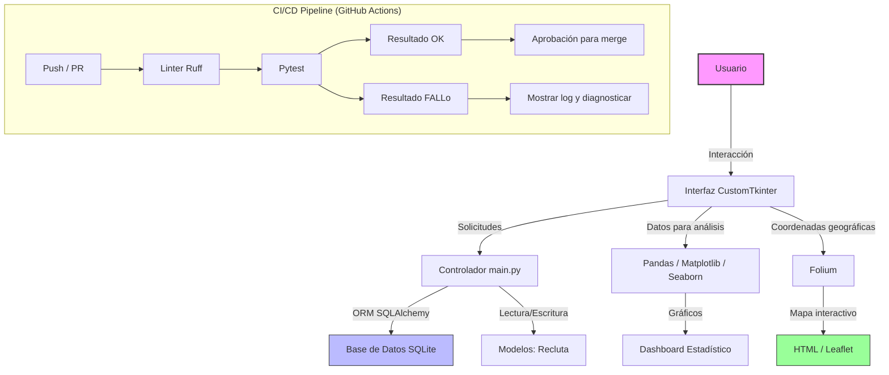
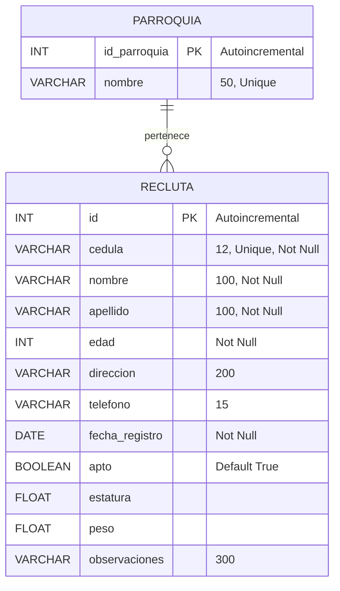
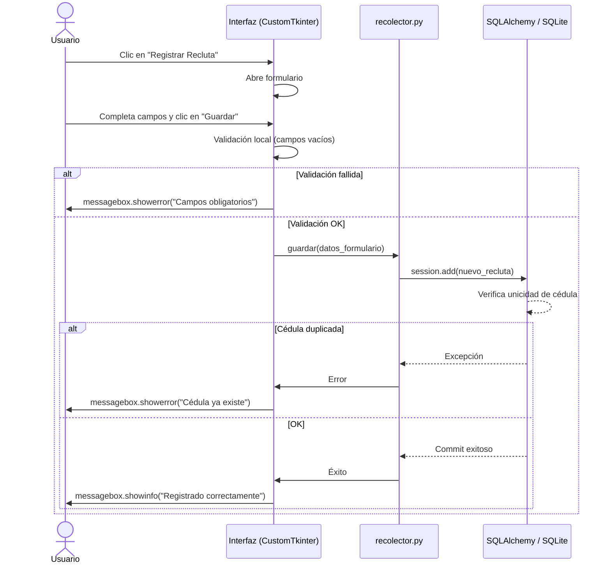
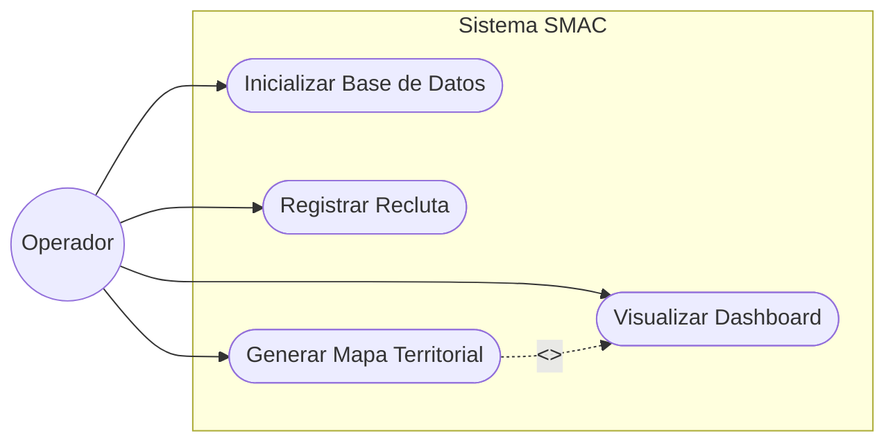
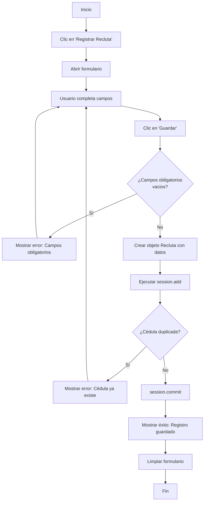

# Plataforma de Análisis Estadístico y Territorial – Servicio Militar Coro

Sistema de escritorio para el registro, análisis estadístico y mapeo territorial del reclutamiento del servicio militar en la ciudad de Coro, Estado Falcón, Venezuela.

## 📐 Arquitectura del Sistema (Doc-as-Code)

### 1. Arquitectura de Componentes y Flujo de Datos

### 2. Diagrama Entidad-Relación (Base de Datos)

### 3.Diagrama de Secuencia (Registro de Recluta)

### 4. Casos de uso de Sistema

### 5. Diagrama de Flujo (Lógica de Registro)
